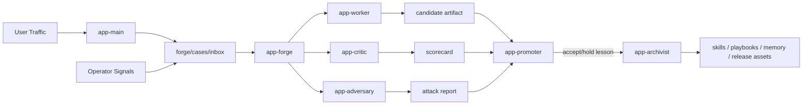

# Vertical Agent Forge

[简体中文 README](./README.zh-CN.md)

Production-grade self-improvement control plane for OpenClaw vertical agents.

Vertical Agent Forge packages a complete improvement operating system around one
user-facing vertical application agent. It gives OpenClaw users a hot-pluggable,
hot-loadable toolkit for:

- durable improvement tasks
- bounded multi-agent review loops
- release gates instead of prompt drift
- reusable artifact contracts
- GitHub-native packaging and release automation

## Why This Exists

Most agent projects fail for one of two reasons:

- everything is packed into one giant agent prompt
- improvement is informal, so quality drifts and regressions are hard to trace

Vertical Agent Forge solves that by separating:

- `app-main`
  - user delivery
- `app-forge`
  - improvement orchestration
- `app-worker`
  - candidate creation
- `app-critic`
  - rubric-based evaluation
- `app-adversary`
  - edge-case and attack discovery
- `app-promoter`
  - release gating
- `app-archivist`
  - durable memory and release distillation

## Architecture



## Product Capabilities

- Hot plug:
  - install into an existing OpenClaw setup without rebuilding OpenClaw itself
- Hot load:
  - merge agent config and workspace assets into the current OpenClaw home
- Durable orchestration:
  - `continuous-worker`, `task`, `wake`, `sessions_spawn`
- Release discipline:
  - proposal, evaluation, promotion, distillation
- GitHub distribution:
  - standalone repo, standalone release workflow, bilingual release assets

## Install

### Option 1. Clone and install locally

```bash
git clone https://github.com/mbdtf202-cyber/vertical-agent-forge.git
cd vertical-agent-forge
npm install
node ./bin/vertical-agent-forge.mjs install
```

### Option 2. Download the release bundle

Use the latest release asset, extract it, then run:

```bash
npm install
node ./bin/vertical-agent-forge.mjs install
```

## What The Installer Does

- copies `kit/workspace/` into your OpenClaw state directory
- installs the toolkit snapshot under `~/.openclaw/toolkits/vertical-agent-forge`
- merges the multi-agent config into your active OpenClaw config
- preserves your current provider/model selection
- pins forge subagents to your current default model so role agents stay on the
  same provider family

## Hot Plug / Hot Load Model

The product is designed for users who already run OpenClaw.

It does not require patching OpenClaw source code.
It works by adding:

- workspace files
- agent definitions
- role skills
- forge playbooks
- packaging / release conventions

## Documentation

- product overview:
  - [README.md](./README.md)
- Chinese overview:
  - [README.zh-CN.md](./README.zh-CN.md)
- architecture:
  - [docs/ARCHITECTURE.md](./docs/ARCHITECTURE.md)
- operations:
  - [docs/OPERATIONS.md](./docs/OPERATIONS.md)
- release process:
  - [docs/RELEASING.md](./docs/RELEASING.md)
- FAQ:
  - [docs/FAQ.md](./docs/FAQ.md)
- changelog:
  - [CHANGELOG.md](./CHANGELOG.md)

## Release Assets

Each release includes:

- `vertical-agent-forge-kit.tar.gz`
- `vertical-agent-forge-kit.tar.gz.sha256`
- `vertical-agent-forge-kit.README.md`
- `vertical-agent-forge-kit.README.zh-CN.md`

## Production Guidance

- keep `app-main` user-facing
- keep `app-forge` internal
- treat Critic and Adversary as required in serious deployments
- review promotion artifacts before auto-accepting process changes
- keep your domain pack explicit and testable

## License

MIT
