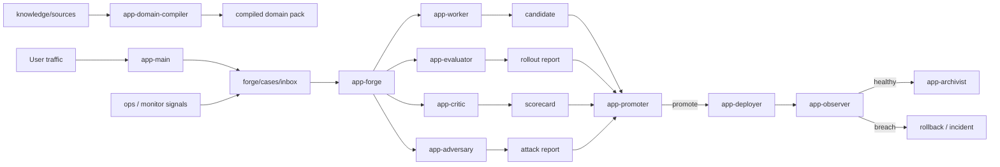

# Vertical Agent Forge

[简体中文 README](./README.zh-CN.md)

Vertical Agent Forge is a production-grade vertical expert-agent factory for
OpenClaw.


VAF 2.0 upgrades the original self-improvement kit into a full factory that can:

- ingest raw business materials
- compile a structured domain pack
- validate artifacts and state transitions
- run regression, shadow, canary, and connector checks
- auto-promote or auto-rollback under full-auto policy
- expose a control-plane plugin with runtime snapshots, metrics, jobs, connectors, and incidents
- keep durable improvement tasks moving with explicit anti-stall and route-pivot rules

## Product Shape

Vertical Agent Forge now ships as a two-part product:

- the main `vertical-agent-forge` kit
  - installer, CLI, workspace kit, role skills, domain templates, release assets
- the companion plugin `vertical-agent-forge-control-plane`
  - SQLite-backed control plane
  - artifact validator
  - connector diagnostics
  - snapshot / jobs / metrics / connectors / incidents RPC methods

This keeps business truth in workspace files while moving runtime enforcement and
operational views into a plugin.

## Why This Exists

Most vertical-agent projects fail because one of these happens:

- all behavior is hidden inside one giant prompt
- domain knowledge never becomes structured assets
- release decisions are informal
- regressions are discovered after user damage, not before rollout
- the system repeats the same failed route instead of changing approach

Vertical Agent Forge solves that by separating user delivery from factory
operations.

## Roles

- `app-main`
  - user-facing vertical expert
- `app-forge`
  - orchestration and state transitions
- `app-domain-compiler`
  - raw materials -> compiled domain pack
- `app-worker`
  - bounded candidate creation
- `app-evaluator`
  - regression / shadow / canary / connector checks
- `app-critic`
  - rubric-based evaluation
- `app-adversary`
  - edge-case and attack discovery
- `app-promoter`
  - release gating
- `app-deployer`
  - rollout and rollback execution
- `app-observer`
  - post-promotion monitoring and incident aggregation
- `app-archivist`
  - durable memory and release distillation

## Factory Flow




## Built-In State Machine

Primary path:

- `inbox -> triage -> building -> validating -> shadow -> canary -> live -> archived`

Exceptional path:

- `hold`
- `reject`
- `rollback`
- `incident`

State transitions are blocked unless required artifacts exist and pass runtime
validation.

## Anti-Stall Supervision

The factory treats these as first-class failures:

- repeating the same hypothesis without new evidence
- finishing consecutive wakes with the same blocker
- waiting on missing upstream artifacts without a narrower next route
- producing motion but not a better shipping decision

When that happens, the forge must:

- write the blocker explicitly
- change route rather than retry blindly
- shrink scope if needed
- slow the wake cadence when external change is required
- hold or reject the case if no credible route remains

## Reference Vertical

VAF 2.0 includes one full reference vertical: `saas-support`.

It ships raw source materials for:

- billing and refund policies
- glossary terms
- action catalog
- eval seeds
- routing and escalation rules
- metric definitions
- simulated Zendesk ticket fixtures
- simulated Stripe plan fixtures

You can bootstrap this profile into a clean workspace and immediately compile,
validate, run evals, deploy, and roll back.

## Connectors

Reference connectors in the control plane:

- `Zendesk`
  - ticket intake / update / tagging / comment draft
- `Stripe`
  - subscription / plan / billing lookup
- `Filesystem Knowledge Base`
  - compiled domain and policy facts

All connectors default to simulator mode when credentials are not present, so
CI and local smoke flows still work end to end.

## Install

### Option 1. Clone and bootstrap locally

```bash
git clone https://github.com/mbdtf202-cyber/vertical-agent-forge.git
cd vertical-agent-forge
npm install
node ./bin/vertical-agent-forge.mjs bootstrap --domain saas-support
```

### Option 2. Use `npx`

```bash
npx vertical-agent-forge bootstrap --domain saas-support
```

### Option 3. Download the release assets

Each GitHub release ships both:

- `vertical-agent-forge-kit.tar.gz`
- `vertical-agent-forge-control-plane.tgz`

Extract the kit archive, then run:

```bash
npm install
node ./bin/vertical-agent-forge.mjs bootstrap --domain saas-support
```

## What Install / Bootstrap Do

`install`:

- installs the toolkit snapshot under `~/.openclaw/toolkits/vertical-agent-forge`
- installs the companion plugin under the toolkit plugin load root
- syncs managed workspace assets into your OpenClaw state directory
- preserves user source files and runtime files outside the managed overwrite set
- merges the multi-agent config and plugin wiring into your active OpenClaw config
- preserves your current provider/model selection
- pins forge subagents to your current default model
- rolls managed file/config changes back if `openclaw config validate` fails

`bootstrap`:

- runs install
- seeds the chosen domain template if sources are still empty
- compiles the domain pack
- validates the factory workspace
- runs strict activation by default

## CLI

Core lifecycle:

```bash
node ./bin/vertical-agent-forge.mjs install
node ./bin/vertical-agent-forge.mjs bootstrap --domain saas-support
node ./bin/vertical-agent-forge.mjs doctor --deep
node ./bin/vertical-agent-forge.mjs status --deep
node ./bin/vertical-agent-forge.mjs uninstall
```

Factory operations:

```bash
node ./bin/vertical-agent-forge.mjs ingest --from ./materials/policies --kind policies
node ./bin/vertical-agent-forge.mjs compile
node ./bin/vertical-agent-forge.mjs validate
node ./bin/vertical-agent-forge.mjs connector-doctor
node ./bin/vertical-agent-forge.mjs run-evals --case CASE-20260317-001 --stage canary
node ./bin/vertical-agent-forge.mjs deploy --case CASE-20260317-001 --stage live
node ./bin/vertical-agent-forge.mjs rollback --case CASE-20260317-001 --reason "canary breach"
```

Activation behavior:

- `activate` is strict by default
- it requires gateway health, companion plugin snapshot, local validator success, and connector preflight success
- pass `--best-effort` only when you intentionally want degraded startup

## Release Assets

Each release includes:

- `vertical-agent-forge-kit.tar.gz`
- `vertical-agent-forge-kit.tar.gz.sha256`
- `vertical-agent-forge-control-plane.tgz`
- `vertical-agent-forge-control-plane.tgz.sha256`
- `vertical-agent-forge-kit.README.md`
- `vertical-agent-forge-kit.README.zh-CN.md`

## Production Guidance

- keep `app-main` user-facing
- keep `app-forge` internal
- treat the control-plane plugin as required in serious deployments
- do not skip rollback plans
- do not ship without rollout evidence
- use simulator mode only for local and CI validation
- keep your source pack explicit and testable

## Documentation

- product overview:
  - [README.md](./README.md)
- Chinese overview:
  - [README.zh-CN.md](./README.zh-CN.md)
- examples:
  - [docs/EXAMPLES.md](./docs/EXAMPLES.md)
- architecture:
  - [docs/ARCHITECTURE.md](./docs/ARCHITECTURE.md)
- operations:
  - [docs/OPERATIONS.md](./docs/OPERATIONS.md)
- release process:
  - [docs/RELEASING.md](./docs/RELEASING.md)
- FAQ:
  - [docs/FAQ.md](./docs/FAQ.md)
- changelog:
  - [CHANGELOG.md](./CHANGELOG.md)
- docs site:
  - [GitHub Pages](https://mbdtf202-cyber.github.io/vertical-agent-forge/)

## License

MIT
