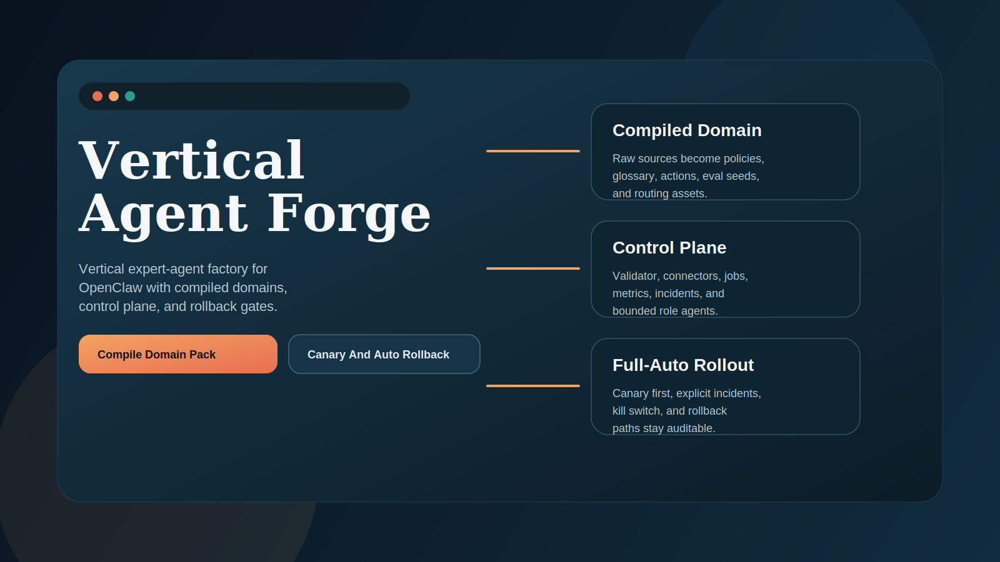
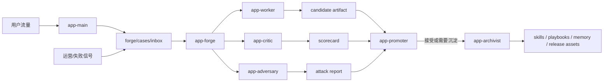
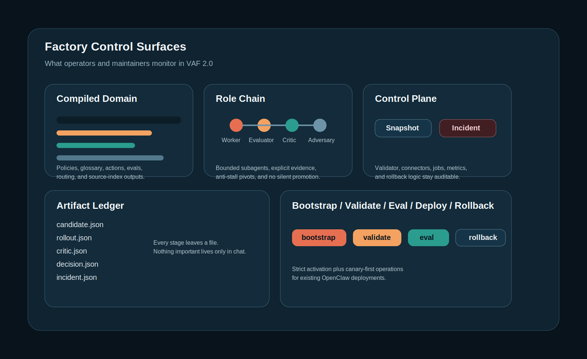

# Vertical Agent Forge

[English README](./README.md)

面向 OpenClaw 垂直应用 agent 的生产级自我迭代控制平面。



Vertical Agent Forge 不是一个“大 prompt”，而是一套完整的改进操作系统，用于给一个用户侧垂直应用 agent 增加以下能力：

- 持久化改进任务
- 有边界的多角色评审链
- 明确的晋升门禁
- 可复用 artifact 合同
- 独立 GitHub 仓库与发布资产

## 为什么要做这个产品

大部分 agent 项目会在两个地方失控：

- 所有能力都塞进一个大 agent prompt
- 改进流程不正式，久而久之难以追踪回归和退化

Vertical Agent Forge 的做法是把角色拆开：

- `app-main`
  - 对用户交付价值
- `app-forge`
  - 编排持续改进
- `app-worker`
  - 生成候选改进
- `app-critic`
  - 用 rubric 评测
- `app-adversary`
  - 找边界条件和攻击样例
- `app-promoter`
  - 决定 `promote | hold | reject | rollback`
- `app-archivist`
  - 把经验沉淀成 durable 资产

## 架构





## 产品能力

- 热插拔：
  - 不改 OpenClaw 源码，直接接入已有 OpenClaw 环境
- 热加载：
  - 把 agent 配置和 workspace 资产合并到当前 OpenClaw home
- Durable orchestration：
  - `continuous-worker`、`task`、`wake`、`sessions_spawn`
- Release discipline：
  - proposal、evaluation、promotion、distillation
- GitHub 分发：
  - 独立仓库、独立 release workflow、中英双语 release 资产

## 安装

### 方案 1：clone 仓库后本地安装

```bash
git clone https://github.com/mbdtf202-cyber/vertical-agent-forge.git
cd vertical-agent-forge
npm install
node ./bin/vertical-agent-forge.mjs install
node ./bin/vertical-agent-forge.mjs activate
```

### 方案 1.5：npm 发布后可直接用 `npx`

```bash
npx vertical-agent-forge install
npx vertical-agent-forge activate
```

### 方案 2：下载 release 包

下载 release 归档并解压后执行：

```bash
npm install
node ./bin/vertical-agent-forge.mjs install
```

## 安装器会做什么

- 把 `kit/workspace/` 复制到你的 OpenClaw state 目录
- 把 toolkit snapshot 安装到 `~/.openclaw/toolkits/vertical-agent-forge`
- 把多 agent 配置合并进当前 OpenClaw 配置
- 保留你当前已有的 provider / model 选择
- 自动让 forge subagents 继承你当前的默认模型，避免角色链漂到不可用 provider

## 热插拔 / 热加载模型

该产品面向已经在使用 OpenClaw 的用户。

它不要求你修改 OpenClaw 源码，而是通过增加：

- workspace 文件
- agent 定义
- 角色 skills
- forge playbooks
- 打包与 release 规范

来实现可插拔集成。

## CLI 生命周期

```bash
node ./bin/vertical-agent-forge.mjs install
node ./bin/vertical-agent-forge.mjs activate
node ./bin/vertical-agent-forge.mjs init --domain saas-support
node ./bin/vertical-agent-forge.mjs upgrade
node ./bin/vertical-agent-forge.mjs doctor
node ./bin/vertical-agent-forge.mjs uninstall
```

- `install`
  - 安装 toolkit workspace 并合并配置
- `activate`
  - 执行 install，并触发初始 forge bootstrap
- `init --domain <template>`
  - 从内置模板初始化 `knowledge/domain/`
- `upgrade`
  - 刷新 toolkit snapshot 并重新合并受管配置
- `doctor`
  - 检查配置、workspace、toolkit 和 agents 是否就绪
- `uninstall`
  - 从配置中移除受管 forge agents，并清理 toolkit 文件

## 文档

- 产品总览：
  - [README.md](./README.md)
- 中文总览：
  - [README.zh-CN.md](./README.zh-CN.md)
- 示例：
  - [docs/EXAMPLES.md](./docs/EXAMPLES.md)
- 架构：
  - [docs/ARCHITECTURE.md](./docs/ARCHITECTURE.md)
- 运维：
  - [docs/OPERATIONS.md](./docs/OPERATIONS.md)
- 发布：
  - [docs/RELEASING.md](./docs/RELEASING.md)
- FAQ：
  - [docs/FAQ.md](./docs/FAQ.md)
- 更新记录：
  - [CHANGELOG.md](./CHANGELOG.md)
- docs 站点：
  - [GitHub Pages](https://mbdtf202-cyber.github.io/vertical-agent-forge/)

## Release 资产

每个 release 都包含：

- `vertical-agent-forge-kit.tar.gz`
- `vertical-agent-forge-kit.tar.gz.sha256`
- `vertical-agent-forge-kit.README.md`
- `vertical-agent-forge-kit.README.zh-CN.md`

## 生产建议

- `app-main` 只面对用户
- `app-forge` 只用于内部改进
- 真正生产环境建议保留 Critic 和 Adversary
- 自动晋升前先检查 promotion artifact
- 你的 domain pack 必须明确、可测试、可回归

## License

MIT
