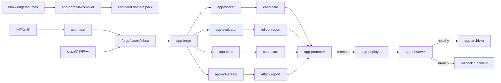

# Vertical Agent Forge

[English README](./README.md)

Vertical Agent Forge 是面向 OpenClaw 的垂直专家 Agent 工厂。


VAF 2.0 不再只是一个自我迭代 control plane kit，而是一整套可以：

- 导入原始业务资料
- 编译结构化 domain pack
- 校验 artifact 与状态迁移
- 跑 regression / shadow / canary / connector 检查
- 在 full-auto 策略下自动发布或自动回滚
- 通过 companion plugin 暴露 snapshot、metrics、jobs、connectors、incidents
- 通过显式 anti-stall / route-pivot 规则避免无意义重试

的完整垂直专家 Agent 工厂。

## 产品形态

Vertical Agent Forge 现在由两个部分组成：

- 主 kit `vertical-agent-forge`
  - 安装器、CLI、workspace kit、角色 skills、领域模板、release 资产
- companion plugin `vertical-agent-forge-control-plane`
  - SQLite 控制面
  - artifact validator
  - connector diagnostics
  - snapshot / jobs / metrics / connectors / incidents RPC

这样可以继续让 workspace 文件作为业务事实源，同时把运行时强校验和运营视图放到 plugin 里。

## 为什么需要它

大多数垂直 agent 项目会在这些地方失控：

- 所有行为都塞进一个大 prompt
- 领域知识从未变成结构化资产
- release 决策不正式
- 回归是在用户受损之后才被发现
- 系统只是重复旧路线，而不是主动切路

Vertical Agent Forge 的做法，是把用户交付和工厂操作彻底拆开。

## 角色

- `app-main`
  - 对外服务的垂直专家 Agent
- `app-forge`
  - 编排与状态迁移
- `app-domain-compiler`
  - 原始资料 -> 编译产物
- `app-worker`
  - 有边界地生成候选改进
- `app-evaluator`
  - 跑 regression / shadow / canary / connector 检查
- `app-critic`
  - 用 rubric 做盲审
- `app-adversary`
  - 找边界条件和攻击样例
- `app-promoter`
  - 做 release gate
- `app-deployer`
  - 执行 rollout 与 rollback
- `app-observer`
  - 监控上线后的健康状态并聚合 incident
- `app-archivist`
  - 把经验沉淀为 durable 资产

## 工厂流程




## 内置状态机

主路径：

- `inbox -> triage -> building -> validating -> shadow -> canary -> live -> archived`

异常路径：

- `hold`
- `reject`
- `rollback`
- `incident`

只有在必需 artifact 存在且通过 runtime validation 之后，状态才允许推进。

## Anti-Stall 监督

工厂把下面这些都视为一类正式失败：

- 同一假设重复出现，但没有新证据
- 连续多个 wake 都以相同 blocker 结束
- 上游 artifact 长时间缺失，但没有更窄的新路线
- 看起来很忙，但没有更接近可发布决策

一旦发生，forge 必须：

- 明确写出 blocker
- 主动切路，而不是盲目重试
- 必要时收缩范围
- 如果依赖外部变化，就主动放慢 wake 节奏
- 如果没有可信路线，就进入 hold 或 reject

## 参考垂直领域

VAF 2.0 内置一个完整参考领域：`saas-support`。

它自带原始 source pack，包括：

- billing / refund policy
- glossary
- action catalog
- eval seeds
- routing 和 escalation 规则
- metric definitions
- 模拟 Zendesk ticket fixture
- 模拟 Stripe plan fixture

你可以直接在一个空 workspace 里 bootstrap，然后马上 compile、validate、run evals、deploy、rollback。

## Connectors

控制面里的参考 connector：

- `Zendesk`
  - ticket intake / update / tagging / comment draft
- `Stripe`
  - subscription / plan / billing lookup
- `Filesystem Knowledge Base`
  - 编译后的 domain 与 policy 事实源

如果没有凭据，所有 connector 默认走 simulator mode，这样本地和 CI 也能完整跑通。

## 安装

### 方案 1：clone 仓库后直接 bootstrap

```bash
git clone https://github.com/mbdtf202-cyber/vertical-agent-forge.git
cd vertical-agent-forge
npm install
node ./bin/vertical-agent-forge.mjs bootstrap --domain saas-support
```

### 方案 2：使用 `npx`

```bash
npx vertical-agent-forge bootstrap --domain saas-support
```

### 方案 3：下载 release 资产

每个 GitHub release 会同时发布：

- `vertical-agent-forge-kit.tar.gz`
- `vertical-agent-forge-control-plane.tgz`

解压主 kit 后执行：

```bash
npm install
node ./bin/vertical-agent-forge.mjs bootstrap --domain saas-support
```

## install / bootstrap 会做什么

`install`：

- 把 toolkit snapshot 安装到 `~/.openclaw/toolkits/vertical-agent-forge`
- 把 companion plugin 安装到 toolkit plugin load root
- 把受管 workspace 资产同步到你的 OpenClaw state 目录
- 保留受管覆盖集合之外的用户 source 文件和运行期文件
- 把多 agent 配置与 plugin wiring 合并进当前 OpenClaw 配置
- 保留你当前已有的 provider / model 选择
- 自动让 forge subagents 继承你当前的默认模型
- 如果 `openclaw config validate` 失败，就回滚受管文件和配置改动

`bootstrap`：

- 先执行 install
- 如果 source 仍为空，则初始化选定的 domain template
- 编译 domain pack
- 校验工厂 workspace
- 默认走严格激活

## CLI

核心生命周期：

```bash
node ./bin/vertical-agent-forge.mjs install
node ./bin/vertical-agent-forge.mjs bootstrap --domain saas-support
node ./bin/vertical-agent-forge.mjs doctor --deep
node ./bin/vertical-agent-forge.mjs status --deep
node ./bin/vertical-agent-forge.mjs uninstall
```

工厂操作：

```bash
node ./bin/vertical-agent-forge.mjs ingest --from ./materials/policies --kind policies
node ./bin/vertical-agent-forge.mjs compile
node ./bin/vertical-agent-forge.mjs validate
node ./bin/vertical-agent-forge.mjs connector-doctor
node ./bin/vertical-agent-forge.mjs run-evals --case CASE-20260317-001 --stage canary
node ./bin/vertical-agent-forge.mjs deploy --case CASE-20260317-001 --stage live
node ./bin/vertical-agent-forge.mjs rollback --case CASE-20260317-001 --reason "canary breach"
```

激活行为：

- `activate` 默认严格
- 要求 gateway 健康、companion plugin snapshot 可用、本地 validator 通过、connector preflight 通过
- 只有你明确接受降级时才用 `--best-effort`

## Release 资产

每个 release 都包含：

- `vertical-agent-forge-kit.tar.gz`
- `vertical-agent-forge-kit.tar.gz.sha256`
- `vertical-agent-forge-control-plane.tgz`
- `vertical-agent-forge-control-plane.tgz.sha256`
- `vertical-agent-forge-kit.README.md`
- `vertical-agent-forge-kit.README.zh-CN.md`

## 生产建议

- `app-main` 只面对用户
- `app-forge` 只用于内部编排
- 真正生产环境里 companion plugin 是必需件
- 不要跳过 rollback plan
- 没有 rollout evidence 不要发布
- simulator mode 只适合本地和 CI
- source pack 必须明确、可测试、可回归

## 文档

- 产品总览：
  - [README.md](./README.md)
- 中文总览：
  - [README.zh-CN.md](./README.zh-CN.md)
- 示例：
  - [docs/EXAMPLES.md](./docs/EXAMPLES.md)
- 架构：
  - [docs/ARCHITECTURE.md](./docs/ARCHITECTURE.md)
- 运维：
  - [docs/OPERATIONS.md](./docs/OPERATIONS.md)
- 发布：
  - [docs/RELEASING.md](./docs/RELEASING.md)
- FAQ：
  - [docs/FAQ.md](./docs/FAQ.md)
- 更新记录：
  - [CHANGELOG.md](./CHANGELOG.md)
- docs 站点：
  - [GitHub Pages](https://mbdtf202-cyber.github.io/vertical-agent-forge/)

## License

MIT
