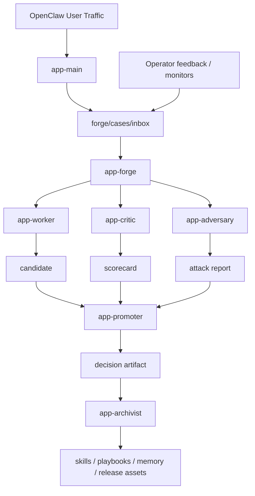

# Architecture

## System Overview

Vertical Agent Forge separates user delivery from self-improvement.

## Runtime Components

- workspace kit
- installer / doctor CLI
- durable task runtime
- role skills
- packaging and release workflow

## Design Rules

- user-facing replies come from `app-main`
- improvement logic is owned by `app-forge`
- release gating is explicit
- every meaningful step should leave a file artifact
